# Weapon Detection System
#### AI powered system for detecting weapons within videos/images (demonstration below)

## Contributers
- Samuel Mohebban (B.A. Psychology- George Washington University) 
    - Samuel.Mohebbanjob@gmail.com
    - [LinkedIn](https://www.linkedin.com/in/samuel-mohebban-b50732139/)
    - [Medium](https://medium.com/@HeeebsInc)
    - [Google Slides Presentation](https://docs.google.com/presentation/d/1yFLW9ku_h9B75V2O8RH7AefB-dC_6_SlKAlIt8v51aY/edit?usp=sharing)

## Business Problem
- Mass shootings have become increasingly prevalent at public gatherings 
- Creating an algorithm that that be integrated into traditional surveillance systems can be used to detect threats faster and more efficiently than those monitored by people 
- In modern surveillance systems, there is a person or group of people, in charge of watching monitors which can span across multiple floors of a given area
- Considering the graphs below, the United States ranks among the top 5 countries in terms of firearm deaths 
    - **Total Deaths** [Data](https://worldpopulationreview.com/country-rankings/gun-deaths-by-country)
    - **Mass Shootings** [Data](https://worldpopulationreview.com/country-rankings/mass-shootings-by-country)
    
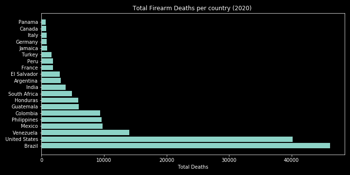

## Solution 
- Create a neural network that can be integrated into traditional surveillance systems 
- This neural network will be able to detect whether a firearm is present in a frame, and if so, it will notify authorities/managers of its detection

## Requirements
- `keras` (PlaidML backend --> GPU: RX 580 8GB)
- `numpy` 
- `pandas`
- `opencv` (opencv-contrib-python)
- `matplotlib`
- `beautifulsoup`

## Data 
- Data used in this project can be found on my Google Drive 
    - [Weapons](https://drive.google.com/file/d/1EZZKhCk0DK3S9zB53o3nWhKrZUbmN2Up/view?usp=sharing)
    - [No Weapons](https://drive.google.com/file/d/13PP-I6VdRt0mrVkquFxF_Y2HO6S1E0lR/view?usp=sharing)
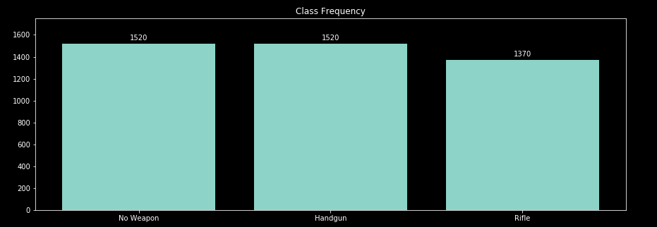
- Total of 5000 images scraped from IMFDB.com- a website where gun enthusiasts post pictures where an actor is using a model gun within a movie 
    - [Scraping Code](Scraping)
- The reason this website is useful for this problem is because it features pictures of people holding guns in various different angles.
    - After labeling each image with a bounding box, images were moved into two folders corresponding to their category - 1. Handgun, 2. Rifle
    - By doing this, the problem became a ternary rather than a binary classification 
- Modeling consisted of two versions: 
    1. **Version 1** = Used both the gun images and the [11K Hands Dataset](https://sites.google.com/view/11khands) collected by Afifi Mahmoud. This dataset features people in various positions and activities.
        - 0 = hand_dataset
        - 1 = Positive Pistol ROI
        - 2 = Positive Rifle ROI
    2. **Version 2** = Used only the gun dataset to create positive and negative images for each class.  For every gun image, it was segmented to create areas where no gun was present (class 0), and where the gun was present (either class 1 or class 2)
        - 0 = Negative ROI
        - 1 = Positive Pistol ROI 
        - 2 = Positive Rifle ROI
- For each image, a bounding box was drawn to find the coordinates of gun within the image.  This process was outsourced to [ScaleOps.AI](https://scaleops.ai/) - a company that specializes in data labeling for machine learning 

## Data Processing 
- Before being fed into the neural network for training, each image was resized to (150,150,3)
- For each image with a bounding box, an algorithm was applied to extract the areas where there is a weapon
    - In the figure below, the image on the right was the original photo. Using that photo and the bounding box coordinates, a new photo was created that focuses on the gun only
    - Not only can this technique be used to minimize unwanted noise, but it can also create new data due to the differences in pixels after applying the algorithm.  In this case, for every original photo, two corresponding images were used for training 

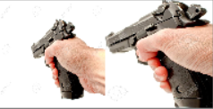

- After resizing, edge detection was tried for each version in order to create images where guns are more distinctive than the latter.  Using edge detection resulted in images with a shape of (150,150), which was then resized to (150,150,1) in order to be fed into the convolutional neural network

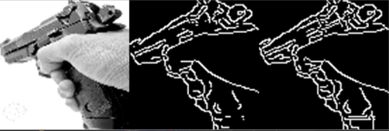

### Model Architecture
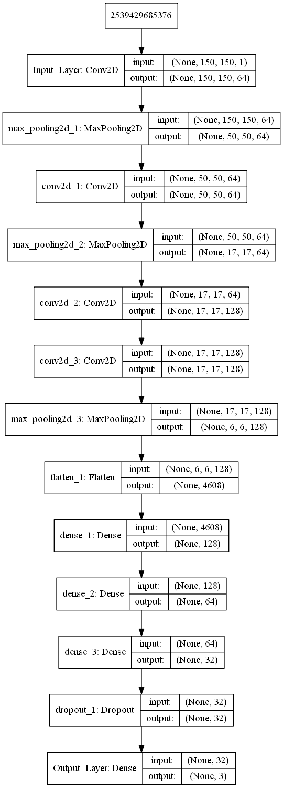

- Categorical Crossentropy was used because the model is used to predict between three classes (0 = No Weapon, 1 = Handgun, 2 = Rifle) 
- Softmax output was used because this is a ternary classification problem 
- To ensure that training continued for more than 20 epochs learning rate was reduced to .0001
- All visualization functions can be found in the [Viz.py](PyFunctions/Viz.py) file within the [PyFunctions](PyFunctions) folder
- For each iteration of the model, we will compare the results between augmentation and non-augmentation, edge and no edge,  as well as the results between using ROI negative dataset compared with the hand_dataset of people
- For each version, there will be 4 iterations of the model, combining to a total of 8 run throughs
    - **Version 1** (ROI and Hand Dataset)
        - Edge and Augmentation 
        - Edge and no Augmentation 
        - No edge and Augmentation 
        - No edge and No Augmentation
    - **Version 2** (ROI only)
        - Edge and Augmentation 
        - Edge and no Augmentation 
        - No edge and Augmentation 
        - No edge and No Augmentation
- Augmentation is used when you want to create more data from the data you already have.  A reason why augmentation can be so helpful is because it can allow your model to train off of features that may not have seemed important otherwise.  Applying augmentation will randomly rotate and distort every image so that your model can become more generalizable when presented with new, untrained data. 
## Modeling 

- A walk through of these steps can be found in the [Technical Notebook](TechnicalNotebook.ipynb)
   
#### Version 1 (F1 Scores- Test)
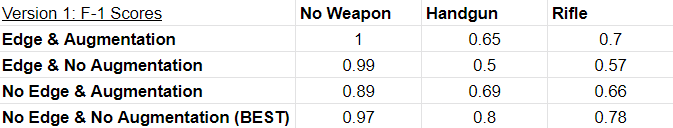
            
#### Version 2 (F1 Scores - Test)
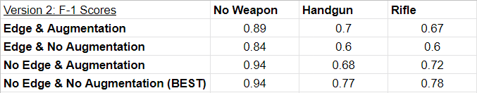

#### Version 1 (ROC Scores- Test)
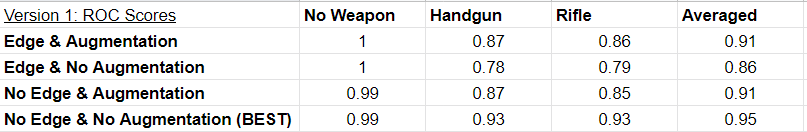
#### Version 2 (ROC Scores - Test)
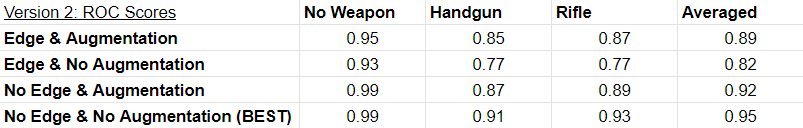
### F1 Scores
- Because the problem is meant to solve weapon detection, I first looked at the best models that showed the highest F1 score for detecting pistols and rifles.  
    - **Version 1 --> No Edge and No Augmentation**
        - No Weapon: 0.97
        - HandGun: 0.80
        - Rifle: 0.78
    - **Version 2 --> No Edge and No Augmentation**
        - No Weapon: 0.94
        - HandGun: 0.77
        - Rifle: 0.78

### ROC Scores 
- To get a better understanding of how the model performs for each class, I then compared the ROC scores between each model. 
    - **Version 1 --> No Edge and No Augmentation**
        - No Weapon: 0.99
        - HandGun: 0.93
        - Rifle: 0.93
        - Averaged: .95
    - **Version 2 --> No Edge and No Augmentation**
        - No Weapon: 0.99
        - HandGun: 0.91
        - Rifle: 0.93
        - Averaged: .95
    
- As a final comparison, I looked at the differences in overall accuracy and loss between the two No Edge and No Augmentation models.  
- Because Version 2 had a higher accuracy and a lower loss than compared with version 1, I chose to use Version 2 as the final model.  
- The final architecture of the model is Version 2, No edge and No Augmentation. The corresponding Loss, accuracy, ROC curves, and confusion matrix for this model can be found below  

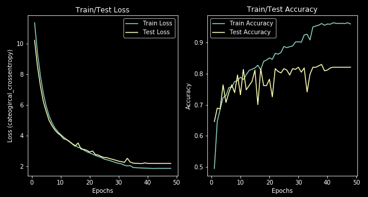

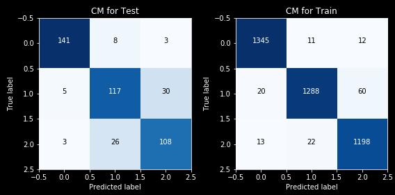

## Transfer Learning 
- After completing my own model, I tried the following pre-built models to compare performance: 
    1) Mobilenet
    2) VGG16 
    
### Mobilenet
- Compared with the model I built, mobilenet was able to achieve a higher accuracy, and higher ROC scores for each class

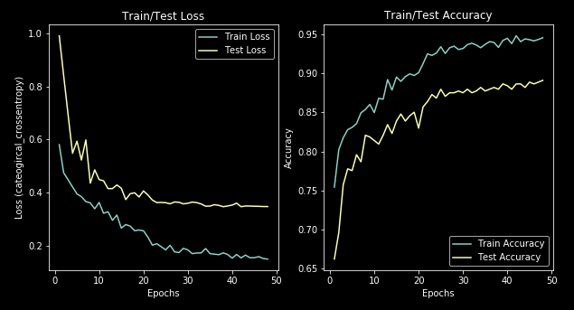

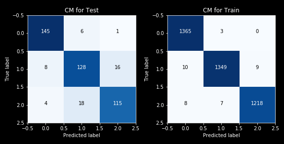

     
     
     

### VGG16 
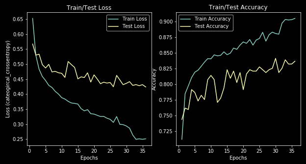
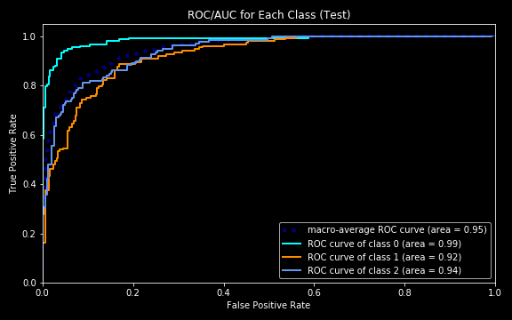
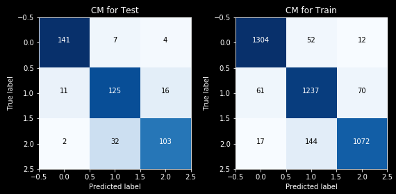

## Deployment 
- [Flask Code](FlaskApp) (WEBSITE COMING SOON) --> The website I built is not yet deployed on a public server.  However, if you would like to see it then clone the repo, and run the [app.py](FlaskApp/app.py) file to see work on your local machine
- The way the deployment architecture works is as follows: 
    1) Input an image or frame within a video and retrieve a base prediction
    2) Apply selective search segmentation to create hundred or thousands of bounding box propositions
    3) Run each bounding box through the trained algorithm and retrieve the locations where the prediction is the same as the base predictions (in step 1) 
    4) After retrieving the locations where the algorithm predicted the same as the base prediction, mark the bounding box on the location
    5) if multiple bounding boxes are chosen, apply non max suppression to suppress all but one box, leaving the box with the highest probability and best Region of Interest (ROI)
    - **Note**:  Non max suppression is a still a work in progress.  In some instances it can only detect features of the gun rather than the entire gun itself(see model comparisons below)  
    

- To try this process on your own images, either go to the website where the model is deployed or [this](OpenCVTesting.ipynb) Notebook. Here, you can use your own images or video and see whether it works. 
- I want to note that there are some issues with NMS as these are still being worked on.  
- Below is a demo of the CNN I built.  The way this works is it spits a video into separate frames then applies the same logic above to each frame.  After creating bounding boxes for each frame, it rejoins them to the video.  To do this on your own video, use the get_vid_frames functions within the [Functions.py](PyFunctions/Functions.py) file

## Comparing Model Performances

- For each model, I compared the accuracy using the images below
- I realize the text for the predictions are small on the readme, so to see them better click the image to navigate to a larger version to see the predictions. 

#### Original CNN

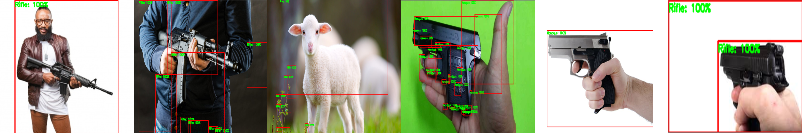

- The neural network I build incorrectly classified a non weapon as a rifle, and incorrectly classified a hand gun as a rifle.  Everything else was correctly classified

#### Mobilenet

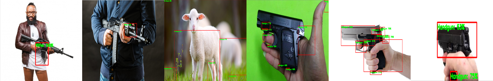

- In the examples above, each model was better at predicting certain features.  
- Non max suppression was different between models
- Mobilenet is better at predicting objects that are not a weapon (class 0 = no weapon)
- Based on these images, Mobilenet correctly predicted every image

#### VGG16 

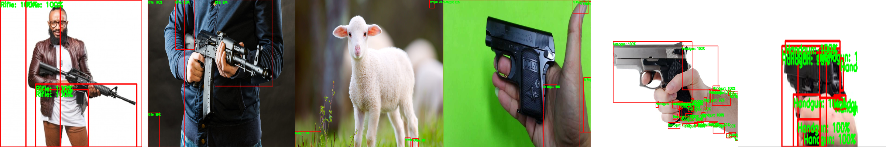

- In the example above, VGG16 was unable to distinguish non weapon
- VGG16 was able to classify rifle
- It incorrectly classified 1 out 3 handgun images as no weapon, while correctly classifying the rest as handgun
- Although it incorrectly classified a hand gun image as having no weapon, the bounding boxes were not on the gun whatsoever and stayed on the hand holding the gun

## LIME: Feature Extraction
- In this section of the notebook, I use [LIME](https://github.com/marcotcr/lime)- a python package that can be used for feature extraction of black box models 
- Below, the areas that are green are those that the algorithm deems "important" for making a prediction 
- This technique is useful because it allowed me to understand what the neural network is basing its predictions off of

#### Normal Model
- For the model I built, the algorithm sometimes focuses on the hand and fingers.  This makes sense because in almost every picture it was trained on, there was a hand present holding the gun
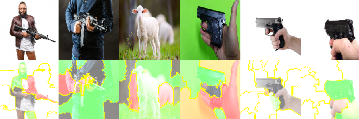

#### Mobilenet

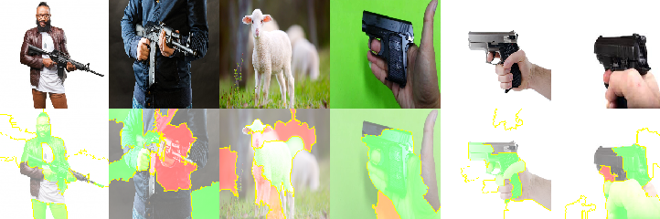

#### VGG16

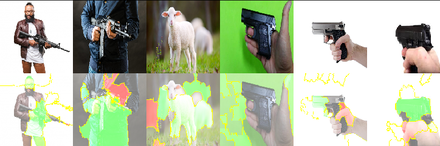

## Limitations
- Splitting a video into frames and processing each image can take anywhere between 5-45 seconds per image depending on the computer 
- Right now, this cannot be applied to live video due to speed concerns 
- Results have a lot of false positives which are problematic for real world situations

## Recommendations 
- Splitting a video into frames and processing each image can take anywhere between 1-30 seconds per image (depending on the computer and size of the image)   
- With my current hardware, this cannot be applied to live video  
- Retroactive video review: 
    - Body cam footage
    - Gun counts at protests

## Future Directions 
- Use more Transfer Learning Models --> these models are already trained on objects such as people, therefore they could decrease false positive rates as it they are better at distinguishing objects that are not guns
- More data. Currently, I have 120,000 images from the IMFDB website, however, creating bounding boxes for each image would require a lot of money and time 
    
    
    
I want to note that much of this project could not have been done without Adrian Rosebrock, PhD, creator of [PyImageSearch](https://www.pyimagesearch.com/).  If you want to learn advanced deep learning techniques I highly recommend his book as well as everything else found on his website. 

 
