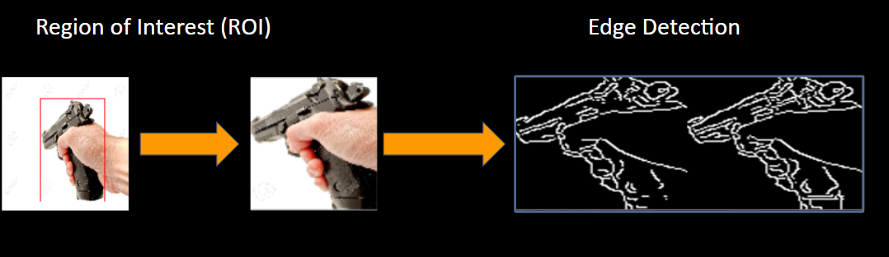
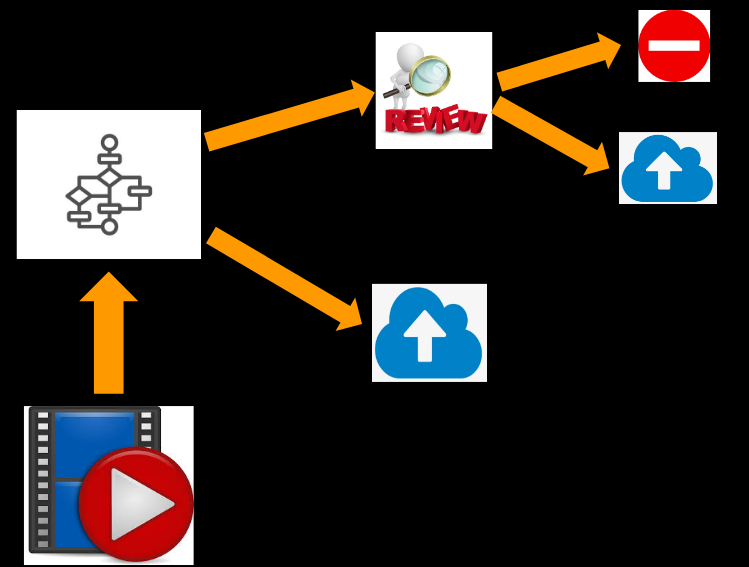
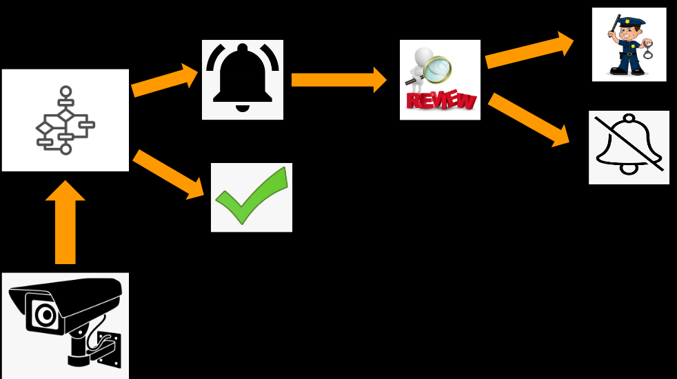

# Weapon Detection System
#### AI powered system for detecting weapons within videos/images (demonstration below)

## Contributers
- Samuel Mohebban (B.A. Psychology- George Washington University) 
    - Samuel.Mohebbanjob@gmail.com
    - [LinkedIn](https://www.linkedin.com/in/samuel-mohebban-b50732139/)
    - [Medium](https://medium.com/@HeeebsInc)
    - [Google Slides Presentation](https://docs.google.com/presentation/d/1yFLW9ku_h9B75V2O8RH7AefB-dC_6_SlKAlIt8v51aY/edit?usp=sharing)

## Business Problem
1. **Mass shootings** have become increasingly prevalent at public gatherings 
- Creating an algorithm that that be integrated into traditional surveillance systems can be used to detect threats faster and more efficiently than those monitored by people 
- In modern surveillance systems, there is a person or group of people, in charge of watching monitors which can span across multiple floors of a given area
2. **Violence on social media platforms** such as Youtube, Facebook, and TikTok
- An algorithm that integrate itself into traditional upload systems can detect violent videos before they are spread on a given website
- Considering the graphs below, the United States ranks among the top 5 countries in terms of firearm deaths 
    - **Total Deaths** [Data](https://worldpopulationreview.com/country-rankings/gun-deaths-by-country)
    - **Mass Shootings** [Data](https://worldpopulationreview.com/country-rankings/mass-shootings-by-country)
    

## Solution 
- Create a neural network that can be integrated into traditional surveillance systems 
- This neural network will be able to detect whether a firearm is present in a frame, and if so, it will notify authorities/managers of its detection

## Requirements
- `keras` (PlaidML backend --> GPU: RX 580 8GB)
- `numpy` 
- `pandas`
- `opencv` (opencv-contrib-python)
- `matplotlib`
- `beautifulsoup`

## Data 
- Data used in this project can be found on my Google Drive 
    - [Weapons](https://drive.google.com/file/d/1EZZKhCk0DK3S9zB53o3nWhKrZUbmN2Up/view?usp=sharing)
    - [No Weapons](https://drive.google.com/file/d/13PP-I6VdRt0mrVkquFxF_Y2HO6S1E0lR/view?usp=sharing)

- Total of 5000 images scraped from IMFDB.com- a website where gun enthusiasts post pictures where an actor is using a model gun within a movie 
    - [Scraping Code](Scraping)
- The reason this website is useful for this problem is because it features pictures of people holding guns in various different angles.
    - After labeling each image with a bounding box, images were moved into two folders corresponding to their category - 1. Handgun, 2. Rifle
    - By doing this, the problem became a ternary rather than a binary classification 
- Modeling consisted of two versions: 
    1. **Version 1** = Used both the gun images and the [11K Hands Dataset](https://sites.google.com/view/11khands) collected by Afifi Mahmoud. This dataset features people in various positions and activities.
        - 0 = hand_dataset
        - 1 = Positive Pistol ROI
        - 2 = Positive Rifle ROI
    2. **Version 2** = Used only the gun dataset to create positive and negative images for each class.  For every gun image, it was segmented to create areas where no gun was present (class 0), and where the gun was present (either class 1 or class 2)
        - 0 = Negative ROI
        - 1 = Positive Pistol ROI 
        - 2 = Positive Rifle ROI
- For each image, a bounding box was drawn to find the coordinates of gun within the image.  This process was outsourced to [ScaleOps.AI](https://scaleops.ai/) - a company that specializes in data labeling for machine learning 

## Data Processing 
- Before being fed into the neural network for training, each image was resized to (150,150,3)
- For each image with a bounding box, an algorithm was applied to extract the areas where there is a weapon
    - In the figure below, the image on the left was the original photo. Using that photo and the bounding box coordinates, a new photo was created that focuses on the gun only
    - Not only can this technique be used to minimize unwanted noise, but it can also create new data due to the differences in pixels after applying the algorithm.  
    - In this case, for every original photo, two corresponding images were used as a positive class (gun) and 5 were used as a negative (no gun) 
- After resizing, edge detection was tried for each version in order to create images where guns are more distinctive than the latter.  Using edge detection resulted in images with a shape of (150,150), which was then resized to (150,150,1) in order to be fed into the convolutional neural network

     

### Model Architecture

     

- Categorical Crossentropy was used because the model is used to predict between three classes (0 = No Weapon, 1 = Handgun, 2 = Rifle) 
- Softmax output was used because this is a ternary classification problem 
- To ensure that training continued for more than 20 epochs learning rate was reduced to .0001
- All visualization functions can be found in the [Viz.py](PyFunctions/Viz.py) file within the [PyFunctions](PyFunctions) folder
- For each iteration of the model, we will compare the results between augmentation and non-augmentation, edge and no edge,  as well as the results between using ROI negative dataset compared with the hand_dataset of people
- For each version, there will be 4 iterations of the model, combining to a total of 8 run throughs
    - **Version 1** (ROI and Hand Dataset)
        - Edge and Augmentation 
        - Edge and no Augmentation 
        - No edge and Augmentation 
        - No edge and No Augmentation
    - **Version 2** (ROI only)
        - Edge and Augmentation 
        - Edge and no Augmentation 
        - No edge and Augmentation 
        - No edge and No Augmentation
- Augmentation is used when you want to create more data from the data you already have.  A reason why augmentation can be so helpful is because it can allow your model to train off of features that may not have seemed important otherwise.  Applying augmentation will randomly rotate and distort every image so that your model can become more generalizable when presented with new, untrained data. 
## Modeling 

- A walk through of these steps can be found in the [Technical Notebook](TechnicalNotebook.ipynb)
   
#### Version 1 (F1 Scores- Test)

     

#### Version 2 (F1 Scores - Test)

     

#### Version 1 (ROC Scores- Test)

     

#### Version 2 (ROC Scores - Test)

     

### F1 Scores
- Because the problem is meant to solve weapon detection, I first looked at the best models that showed the highest F1 score for detecting pistols and rifles.  
    - **Version 1 --> No Edge and No Augmentation**
        - No Weapon: 0.97
        - HandGun: 0.80
        - Rifle: 0.78
    - **Version 2 --> No Edge and No Augmentation**
        - No Weapon: 0.94
        - HandGun: 0.77
        - Rifle: 0.78

### ROC Scores 
- To get a better understanding of how the model performs for each class, I then compared the ROC scores between each model. 
    - **Version 1 --> No Edge and No Augmentation**
        - No Weapon: 0.99
        - HandGun: 0.93
        - Rifle: 0.93
        - Averaged: .95
    - **Version 2 --> No Edge and No Augmentation**
        - No Weapon: 0.99
        - HandGun: 0.91
        - Rifle: 0.93
        - Averaged: .95
    
- As a final comparison, I looked at the differences in overall accuracy and loss between the two No Edge and No Augmentation models.  
- Because Version 2 had a higher accuracy and a lower loss than compared with version 1, I chose to use Version 2 as the final model.  
- The final architecture of the model is Version 2, No edge and No Augmentation. The corresponding Loss, accuracy, ROC curves, and confusion matrix for this model can be found below  

     
     
     

## Transfer Learning 
- After completing my own model, I tried the following pre-built models to compare performance: 
    1) Mobilenet
    2) VGG16 
    
### Mobilenet
- Compared with the model I built, mobilenet was able to achieve a higher accuracy, and higher ROC scores for each class

     
     
     

### VGG16 

     
     
     

## Deployment 
- [Flask Code](FlaskApp) (WEBSITE COMING SOON) --> The website I built is not yet deployed on a public server.  However, if you would like to see it then clone the repo, and run the [app.py](FlaskApp/app.py) file to see work on your local machine
- The way the deployment architecture works is as follows: 
    1) Input an image or frame within a video and retrieve a base prediction
    2) Apply selective search segmentation to create hundred or thousands of bounding box propositions
    3) Run each bounding box through the trained algorithm and retrieve the locations where the prediction is the same as the base predictions (in step 1) 
    4) After retrieving the locations where the algorithm predicted the same as the base prediction, mark the bounding box on the location
    5) if multiple bounding boxes are chosen, apply non max suppression to suppress all but one box, leaving the box with the highest probability and best Region of Interest (ROI)
    - **Note**:  Non max suppression is a still a work in progress.  In some instances it can only detect features of the gun rather than the entire gun itself(see model comparisons below)  
    

- To try this process on your own images, either go to the website where the model is deployed or [this](OpenCVTesting.ipynb) Notebook. Here, you can use your own images or video and see whether it works. 
- I want to note that there are some issues with NMS as these are still being worked on.  
- Below is a demo of the CNN I built.  It works by splitting a video into separate frames then applying the same logic above to each frame.  After creating bounding boxes for each frame, it rejoins them back to a video.  To do this on your own video, use the get_vid_frames functions within the [Functions.py](PyFunctions/Functions.py) file

## Comparing Model Performances

- For each model, I compared the accuracy using the images below
- I realize the text for the predictions are small on the readme, so to see them better click the image to see a larger version. 
- Non-maxima suppression was different between models

#### Original CNN

- The neural network I build incorrectly classified a non weapon as a rifle, and incorrectly classified a hand gun as a rifle.  Everything else was correctly classified

#### Mobilenet

- Mobilenet is better at predicting objects that are not a weapon (class 0 = no weapon)
- Based on these images, Mobilenet correctly predicted every image

#### VGG16 

- VGG16 was unable to distinguish non weapon
- VGG16 was able to classify rifle 100% of the time
- It incorrectly classified 1 out 3 handgun images as no weapon, while correctly classifying the rest as handgun
- Although it incorrectly classified a hand gun image as having no weapon, the bounding boxes were not on the gun whatsoever and stayed on the hand holding the gun

## LIME: Feature Extraction
- In this section of the notebook, I use [LIME](https://github.com/marcotcr/lime)- a python package that can be used for feature extraction of black box models 
- Below, the areas that are green are those that the algorithm deems "important" for making a prediction 
- This technique is useful because it allowed me to understand what the neural network is basing its predictions off of

#### Normal Model
- For the model I built, the algorithm sometimes focuses on the hand and fingers.  This makes sense because in almost every picture it was trained on, there was a hand present holding the gun

#### Mobilenet

#### VGG16

# Final Thoughts 

## Limitations
- Splitting a video into frames and processing each image can take anywhere between 5-45 seconds per image depending on the computer 
- Results have a lot of false positives which are problematic for real world situations

## Recommendations 
- Although this process is slow on my current hardware, it could in fact be fast enough using parallel computing or more advanced GPUs (2080ti or Nvidia 3000 series cards)
- Modern video surveillance equipment records at a rate of (30-60 fps), but we do not need to run the algorithm on all 30 frames. This would be computationally expensive, and a large amount of processing would be wasted on video that does not even contain people in it. It could be used as part of a pipeline that activates when the camera detects movement/a person in the frame, and we could sample and process 3 frames per second (utilizing only 10% of the video) on a much faster, centralized server 
- The current system can be used for other things such as retroactive video review: 
    - Body cam footage
    - Gun counts at protests
    - Violent online videos (YouTube, TikTok, Twitter,etc.)
- Applying the algorithm to the examples above will provide an un-bias input for a given altercation. 
- For example, if a police officer claimed to have used force on a person due to them thinking that person had a gun, this algorithm can be used to determine a timeline that maps the escalation in chronological order.  
- Although this algorithm should not be used as a defining classifier, it can be used in conjunction with investigations in order to determine if the right decision was made. 
- On the other hand, this algorithm can also be used to detect the presence of guns at protests, and with some modification, count the number of guns it detected.  This can be helpful because it allows law enforcement to get a numerical representation of threats within public areas.  
- Finally, this algorithm can be used to detect the presence of a weapon in a video after it has been uploaded to a social media site (such as YouTube.com).  Using this algorithm to detect weapons within an uploaded video would be faster and more efficient then having a team do it manually.  
    - [This article](https://inews.co.uk/news/technology/tiktok-suicide-video-live-stream-man-death-remove-app-639699) discusses an instance where a man killed himself on the popular platform Facebook. Once the video surfaced on the platform, it spread across multiple different accounts very rapidly on another popular platform, TikTok.  Based on this example, if a company such as YouTube, Facebook, or TikTok ran every video that was uploaded through this algorithm, these threats would be detected before they can be spread online
    - Below is an animation for how this would work.  When a video is uploaded to a site such as Youtube, it will be run through this algorithm before it is listed on the site.  If the algorithm approves it, then it moves onto the official upload.  If the algorithm flags it, then it must be given to another team for manual review.  If the team deems it okay for upload, it gets uploaded to the site, otherwise it is blocked. 

     

#### Things to Consider
- **False Positive Rate**: If a weapon is detected when there was not actually a weapon, false hysteria can be created as there was no actual threat.  A high number of false positives may result in people ignoring alerts from the system, creating a boy-who-cried-wolf scenario 
- **True Positive Rate**: Being able to detect a weapon in real time can save lives given an area is too large for cameras to monitor.  
- Considering false positives, if this were to be deployed in a real-world scenario, the following steps must be taken to ensure detection is properly managed 
    1. If a weapon is detected as present, it should not notify police/law enforcement directly. 
    2. Instead, if a weapon is detected it should be relayed to personnel working within the building/area 
    3.  This process can be beneficial as there can be multiple monitors spanning across different areas, so direct notification of a threat can be faster than waiting for the video to pop up 

     

- An intermediary review of a threat is crucial when notifying law enforcement.  If law enforcement was notified due to a presence of a weapon when there actually was not one, this could create exactly the problem we are intending to solve- **_Public Safety_**.
    - For example, if a person was marked as having a weapon when they in face did not, they would be placed in harms way.
    - Another example would be a child playing with a toy gun [Tamir Rice Incident](https://en.wikipedia.org/wiki/Shooting_of_Tamir_Rice)
    - For these reasons, there must be a intermediary review so that these detections do not warrant escalated action 
- The goal behind this project is to promote public safety.  As public areas are very large, it is hard to apply video surveillance to monitor every area at the same time.  Using this system, a security team can better monitor every area at the same time, and be notified quicker if there is in fact a weapon present. 

## Future Directions 
- Use more Transfer Learning Models --> these models are already trained on objects such as people, therefore they could decrease false positive rates as it they are better at distinguishing objects that are not guns
- More data. Currently, I have 120,000 images from the IMFDB website, however, creating bounding boxes for each image would require a lot of money and time 
    
    
        
I want to note that much of this project could not have been done without Adrian Rosebrock, PhD, creator of [PyImageSearch](https://www.pyimagesearch.com/).  If you want to learn advanced deep learning techniques I highly recommend his book as well as everything else found on his website. 

 
